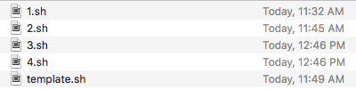
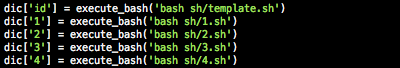
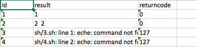

# Usage

1. write bash command in a file like `<id>.sh` and put into directory `sh`


   

2. add dictionary variable after 51th line in `run.py` as below:

   ```python
   dic['<id>'] = execute_bash('bash <path>')
   # <id> will used for excel file as item's id
   # <path> should point to bash file like 'sh/1.sh'
   ```

   

   

3. execute `python3 run.py` or `./run.py`

4. check your `result.json` and `result.xlsx` in curren directory.
